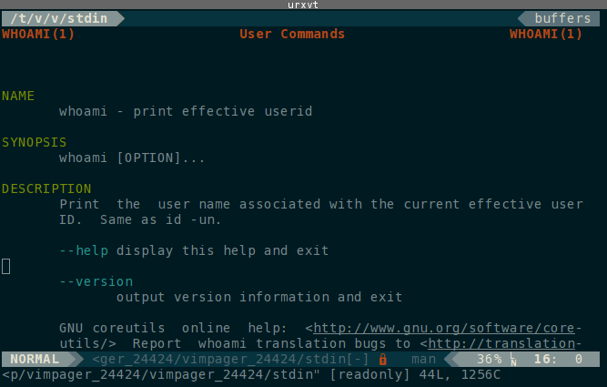

# Basic Shell Commands

Upon firing up a terminal emulator, it will start some flavor of textual
command-line-interface (**cli**) called a **shell**. There are many
different shells available including but not limited to:


bash
  : the **B**ourne-**a**gain **sh**ell
  
zsh 
  : **Z**hong **Sh**ao shell

sh 
  : the original Bourne **sh**ell

csh 
  : the **C**-**sh**ell

tcsh 
  : the **T**ENEX-**csh**

ksh 
  : the **K**orn **sh**ell

fish 
  : the **f**riendly **i**nteractive **sh**ell

...
  : ad nauseum
{:.dl-horizontal}

On most systems, including Linux and modern MacOS, the default shell will be bash.
Some older Unix and Mac systems will use (t)csh by default. Unless specifically
stated we will assume the use of bash, although many shells are so similar that
there is little functional difference for the casual user. Bash is arguably the
best and certainly the most popular shell although some newer shells like zsh and
fish are making their way onto systems by default.

## The Prompt

The shell presents itself as a **prompt**. The appearance of the prompt can be
customized and often is different from system to system even if they are running
the same shell. It is common, however, to have the last character in the prompt
be `$`. 

``` bash
$ 
```

From the prompt, we can issue **commands** to do virtually anything we wish a
computer to do. Every command is either a program, script or shell function. We
issue a command by typing it in at the prompt and pressing <kbd>Enter</kbd>.

Most commands expect number of mandatory **positional arguments** which are
typed after the command name, in order, and each separated by a
<kbd>Space</kbd>.  Most commands can also take a number of non-mandatory
**optional arguments** or **switches**. Switches can dramatically alter what a
command does.  A switch is invoked by writing it's name after a command.  

All switch names start with a hyphen. One hyphen <kbd>-</kbd> is used if
the switch has a single character name and two hyphens <kbd>--</kbd> are used if
the switch name is more than one character.
{:.alert .alert-info}

**Arguments to a switch, when needed, follow the switch name.** If a switch
expects an argument, that is then written following the switch name separated by
a <kbd>Space</kbd>. 
{:.alert .alert-info}

Switches that do not take an argument can be grouped together after a single
hyphen.
{:.alert .alert-info}

**Every part of a command is Space separated.** The command, all its arguments
(both positional and optional) and any switches invoked after a command must
each be separated by a <kbd>Space</kbd>.
{:.alert .alert-warning}

**Commands and arguments are case-sensitive.** You will find that most commands and
multi-character switches are all lowercase, while single character switches to
be of any case. **Some commands will have single character switches of the same
name, but different case!**
{:.alert .alert-danger}

We'll look at some examples using basic commands first.

## Who and Where am I?

The command `whoami` will return the username you are currently logged in as:

``` bash
$ whoami
prismo
```

The command will dump it's response below the prompt and issue a new one.
Once you know *who* you are, it helps to know *where* you are. The shell keeps
track of where you are in the filesystem (much like a file manager). Many
commands that you issue need the location of files relative to where you
currently are. To find out what directory you are currently in, issue the
command `pwd` (short for 'print working directory'):

``` bash
$ pwd
/home/prismo
```

It is useful to know the hostname of the machine you are using, especially if
you are using a machine remotely through a terminal. We find this with the
command `hostname`:

``` bash
$ hostname
timeroom
```

Many folks will modify their prompt to include all this information in the
prompt so they don't lose track of who and where they are so some prompts may
look like:

``` bash
[prismo@timeroom: /home/prismo] $
```

but for brevity, examples here will just use `$` and sometimes maybe `#` as the
shell prompt.

## Getting Help

We're going to learn a lot of commands. If you are new to this, relax: no one
expects you to remember everything about working in a shell. It takes years of
regular use to recall the syntax for all but the most used commands. The
developers of all this stuff know this and have provided some help that you can
access right from the prompt. This can be done two ways:

Most commands implement a switch named `--help` that will print a summary of a
command's use and syntax without actually running the command. It looks like
this:

``` nohighlight
$ whoami --help
Usage: whoami [OPTION]...
Print the user name associated with the current effective user ID.
Same as id -un.

      --help     display this help and exit
      --version  output version information and exit

GNU coreutils online help: <http://www.gnu.org/software/coreutils/>
For complete documentation, run: info coreutils 'whoami invocation'
```

The other means of getting help in the terminal is by reading the command's
manual page. To access the manual for a command, we invoke the command `man`.
The command `man` takes the name of the command you wish to see the manual for
as an argument.  The manual page will appear in a terminal text-viewing program
called a **pager**.

``` bash
$ man whoami
```



The manual pages tend to be complete and will tell you everything you could want
to know, but they can sometimes be daunting. To sort out all this mess, 
you should take a moment to read `man`'s manual page:

``` bash
$ man man
```

A manual page's SYNOPSIS section is often all you really care about reading.

``` nohighlight
The following conventions apply to the SYNOPSIS section
and can be used as a guide in other sections.

bold text          type exactly as shown.
italic text        replace with appropriate argument.
[-abc]             any or all arguments within [ ] are optional.
-a|-b              options delimited by | cannot be used together.
argument ...       argument is repeatable.
[expression] ...   entire expression within [ ] is repeatable.

Exact rendering may vary depending on the output  device.   For  instance,
man will usually not be able to render italics when running in a terminal,
and will typically use underlined or coloured text instead.
```

## Getting Around

The most used commands are the ones for moving yourself and files
around the filesystem.


| Command | Mnemonic         | Description 
|---------|------------------|------------------------------------------------
| `ls`    | list             | Lists directory contents
| `cd`    | change directory | Change current working directory
{:.table}

### `ls`

The contents directory can be listed by the `ls` command.  The behavior of `ls`
can be greatly altered by the many switches available to it. The more useful
ones include:

  * `-l` long format showing more details
  * `-h` print file sizes in a more human-readable format
  * `-a` show all files, including hidden files
  * `-t` sort by modification time
  * `-S` sort by file size.
  * `-X` alphabetically by extension
  * `--group-directories-first` sort directoris before files

 Here is what the output of `ls` looks like on a typical system:


**Hidden files.** On UNIX-like systems, files starting with a period `.` are considered 'hidden'
and are not normally listed by `ls`.
{:.alert .alert-warning}

### `cd`

To move between directories, we use the `cd` command, which takes the **path**
of the directory you wish to move to as an argument.

``` bash
$ cd /home/prismo/pickle_recipes
```

Files and directories can be referred to by either their **absolute path** or
their **relative path** with respect to where you currently are.
{:.alert .alert-info}

To understand paths, we must first explain how directories are
structured in a UNIX-like system.

### The UNIX Directory Tree

The UNIX standard outlines an order for where files should go. UNIX-like
operating systems like Linux and MacOS share much of this structure. The Windows
file tree however is very different. The UNIX directory tree starts at a
directory called 'the root directory' or 'root'. The root directory is located 
at `/` which is read as either 'root' or 'slash'. Using `ls`, we can inspect 
the contents of a typical root directory:


A typical UNIX filesystem will have the following directories and subdirectories:

| Path              | Read As           | Contains                                              | 
|:------------------|:------------------|:------------------------------------------------------|
| `/`               | root              | The root filesystem, highest directory in the system  |
| `/boot`           | ...               | bootloader                                            |
| `/dev`            | device            | system device files                                   |
| `/etc`            | et-cetera, etsy   | global system configuration files                     |
| `/home`           | ...               | user's personal directories                           |
| `/media`          | ...               | mountpoints removable media                           |
| `/mnt`            | mount             | abstract temporarily mounted filesystems              |
| `/opt`            | optional          | third-party software                                  |
| `/proc`           | process, prok     | process/kernel virtual fs                             |
| `/root`           | root-home         | root user's home directory                            |
| `/run`            | ...               | ramdisk tmpfs for temporary OS runtime files          |
| `/sys`            | system, sys       | system virtual fs                                     |
| `/tmp`            | temp, temporary   | ramdisk tmpfs for general temporary files             |
| `/usr`            | user              | userland applications                                 |
| `/usr/bin`        | user bin          | system commands, applications, and binaries           |
| `/usr/include`    | user include      | system programming header files                       |
| `/usr/lib`        | user lib          | system shared libraries                               |
| `/usr/local`      | user local        | same as /usr but for host-specific files/commands     |
| `/usr/share`      | user share        | system shared resource files                          |
| `/var`            | variable, var     | runtime variable files                                |
{:.table}

For those coming from Windows, `/` is in some ways like `C:\` except that it is
a bit more abstract. On Windows systems, `C:\` is the root directory of a single
disk partition. On UNIX-like systems `/` is the root directory of everything,
and it not limited to a single disk partition. All other mounted filesystems
and disk partitions appear as subdirectories of `/`. 
{:.alert .alert-info}

As a user, all of your personal files will reside in `/home/username` and this
is where you'll spend most of your time. For users familiar with Windows, this
is like the `C:\Users\username` directory.
{:.alert .alert-info}

Most of the programs and executables on a UNIX system reside in the `/usr/bin`
('bin' for 'binary' as in *binary executable*) directory.
{:.alert .alert-info}

### Using `cd`

Absolute paths are always referenced from the root directory and will always
start with a `/` like this path to a directory 'documents' in the home directory
of the user 'prismo':

``` bash
$ cd /home/prismo/documents
```
Regardless of what directory you are currently in, changing directory with an
absolute path will take you where you wanted to go.
{:.alert .alert-info}

Writing out absolute paths is long and tiresome. Often we are already in a
directory that is close to our intended destination. In this case, we can use a
relative path with respect to our current working directory:

``` bash
$ pwd
/home/prismo
$ cd documents
$ pwd
/home/prismo/documents
```
Every directory contains at least two
special hidden directories: 

  * `.` refers to the current working directory (cwd)
  * `..` refers to the parent directory of the cwd.

We can use these to make relative paths up the directory tree:

``` bash
$ pwd
/home/prismo/documents
$ cd ../science
$ pwd
/home/prismo/science
```

You will spend most of your time in your home directory, and so there are
special ways of refering to your home directory. The name `~` refers to the
absolute path of your home directory. Regardless of where you are in the
filesystem, you can do things like:

``` bash
$ pwd
/var/log
$ cd ~/documents
$ pwd
/home/prismo/documents
```

In fact, `~` is an alias for something called the `$HOME` environment variable.
We'll learn more about environment variables later. 
{:.alert .alert-info}

If `cd` is given no arguments, it will return you to `~`.

``` bash
$ pwd
/var/log
$ cd
$ pwd
/home/prismo
```

Lastly, `cd` remembers the last working directory in an environment variable
`$OLDPWD`. When `cd` is called with a hyphen as it's argument, it will change
directories to the last remembered working directory and print its name:

``` bash
$ pwd
/home/prismo/documents
$ cd ../research/pickle_recipes
$ pwd
/home/prismo/research/pickle_recipes
$ cd -
~/documents
$ pwd
/home/prismo/documents
```

So to summarize the special directory names:

| Name   | Location                  |
|--------|---------------------------|
| `.`    | current working directory |
| `..`   | parent of cwd             |
| `~`    | user home directory       |
| `-`    | last working directory    |
{:.table}


## Manipulating Files

The following table of commands consists of those used for creating, moving, and
destroying (deleting) files and directories.

| Command | Syntax                        | Description 
|---------|-------------------------------|------------------------------------------------
| `mkdir` | `mkdir [OPT]... DIRECTORY...` | Makes a new directory at path DIRECTORY
| `mv`    | `mv [OPT]... SRC DEST`        | Moves (renames) file at path SRC to path DEST
|         | `mv [OPT]... SRC... DIR`      | Moves all SRCs into directory DIR
|         | `mv [OPT]... -t DIR SRC...`   | Moves all SRCs into directory DIR
|=========|===============================|================================================
| `cp`    | `cp [OPT]... SRC DEST`        | Copies SRC to a new location DEST
|         | `cp [OPT]... SRC... DIR`      | Copies all SRCs into directory DIR
|         | `cp [OPT]... -t DIR SRC...`   | Copies all SRCs into directory DIR
|=========|===============================|================================================
| `rm`    | `rm [OPT]... FILE`            | Deletes FILE from the filesystem
|         | `rm [OPT]... -r DIR`          | Deletes directory DIR and their contents recursively 
|=========|===============================|================================================
| `touch` | `touch [OPT]... FILE...`      | Touches the filesystem, creating empty FILEs
| `rmdir` | `rmdir DIR...`                | Removes empty DIRs from the filesystem
{:.table}

The syntax for the above commands are taken directly from their manual
pages. Each syntax should be written on a single line!
{:.alert alert-danger}

There is a command `rename` but it does not work the way you think. The ordinary
way to rename a file is to move it into it's new name using `mv`.
{:.alert .alert-warning}

The commands `rm` and `rmdir` will not remove a non-empty directory. To do that,
you must use `rm`'s 'force' and 'recursive' switches `rm -rf PATH`.
{:.alert .alert-warning}

**Commands to delete a file cannot be undone!** There is no 'recycle bin' when using
shell commands.
{:.alert .alert-danger}

## File Permissions

Unix-like systems are what we call *multi-user* environments. As such, they
attach attributes, called **permissions**, to every file (including directories)
that control access to that file.

There are three types of access to a file. **Read (r)** access allows a file to be
read; **write (r)** access allows a file to be created, modified, or deleted; and
**execute (x)** access allows a program to be run or a directory to be entered.

On top of this, there are three levels of permission granularity controlling who
has these permissions. Permissions can be granted to to the file's **owning user
(u)**, to members of a file's **group (g)**, or to everyone else or **others
(o)**.

We can inpect what permissions a file has by looking at the long-form output of
`ls -l`:


``` bash
$ ls -l
total 0
drwxr-x--- 2 prismo cosmowl     40 Feb  2 01:26 limited
drwx------ 2 prismo prismo      40 Feb  2 01:26 private
drwxr-xr-x 2 jake   finn        40 Feb  2 01:26 public
drwxrwxrwx 2 prismo ooo         40 Feb  2 01:27 reckless
-rw------- 1 pepbut pepbut       0 Feb  2 01:32 confidential
-rw-r--r-- 1 peeble peeble       0 Feb  2 01:26 default
-rw-rw-r-- 1 peeble royalty      0 Feb  2 01:31 group_edit
-rwxrwxrwx 1 lich   lich         0 Feb  2 01:38 insane
-rwxr-xr-x 1 root   root         0 Feb  2 01:30 program
-rwx------ 1 randy  bnubs        0 Feb  2 01:30 secret_script
```

The first column shows the file's permissions as a string of characters.

In order from left to right, the characters indicate:

  * File is a directory (**d**), symbolic link (**l**), or neither (**-**)
  * Owning user has read access (**r**) or not (**-**)
  * Owning user has write access (**w**) or not (**-**)
  * Owning user has execute access (**x**) or not (**-**)
  * Group members have read access (**r**) or not (**-**)
  * Group members have write access (**w**) or not (**-**)
  * Group members have execute access (**x**) or not (**-**)
  * Others have read access (**r**) or not (**-**)
  * Others have write access (**w**) or not (**-**)
  * Others have execute access (**x**) or not (**-**)

The second column indicates the number of **links** that point to the file.
Directories always have at least 2 (`.` and `..`) while files have at least one.

The third column is the owning user's name.

The fourth column is the file's group name.

The fifth column is the filesize (default in bytes).

The sixth column is the month, day, time/year that the file was last
modified.

The seventh column is the filename.

To see what groups your username is a member of, use the `groups` command. If
you are in the same group as a file, then the file's group permissions are
granted to you.
{:.alert .alert-info}

**Permissions are additive.** Everyone is granted *others* permissions. All
members of a file's group are granted *group* permissions. The owning user is
granted *user* permissions. If you have some permissions from each category,
they all will apply to you.
{:.alert .alert-info}

### Changing File Permissions

We can modify the permissions of a file with the command `chmod` (short for 'change mode
bits'). The syntax is 

``` bash
$ chmod MODE FILE
```

where MODE is either a symbolic modifer string or an octal number representing
the desired bit mode. The symbolic representation is easier to use for
beginners. From the man page:


    The format of a symbolic mode is [ugoa...][[-+=][perms...]...],
    where perms is either zero or more letters from the set rwxXst,
    or a single letter from the set ugo.

The set `ugoa` corresponds to user, group, others, and all. The operators `-+=`
remove, add, or set exactly the permissons that follow. The set of perms
`rwxXst` correspond to read (r), write (w), execute (x), and three other modes.
(X) sets the execute (x) bit only if the file is a directory or an (x) bit is
already set, (s) sets the set uid/gid bit, and (t) sets the "sticky bit" that
restricts deletion. The last two (s) and (t) are uncommon for most casual uses.

Multiple symbolic modes, separated by commas, can be passed at the same time.

So for example to add the read and write permissions for the owning user and
group of a file, while removing everything from others, we write:

``` bash
$ chmod ug+rw,o-wrx file
```

When sharing files with others, or when writing programs, you must make sure the
permissions are set correctly. For instance, a common issue for beginners is to
forget to set executable permissions on scripts.

Another thing to be careful about is ensuring sensitive files are private or
restricted. For instance, any public-private cryptography keys you have must be
kept secret and should have permissions '-rw-------' (they should be considered
compromised if they are ever readable, even for a moment, by anyone other than
the owning user). Likewise, progams usually should have write permissions only
for the owning user otherwise the code could be modified by a malicious user.

In the example above, the directory 'reckless' and the program 'insane' have
dangerous permissions and should be avoided unless you really know what you're
doing. The directory 'public', the file 'default', and the program 'program'
have pretty typical settings for non-sensitive files. Lastly, 'private',
'confidential', and 'secret_script' have permissions that are typical for
sensitive or secret files.

When used properly, UNIX permissions are a powerful management tool that keep
systems secure.

### Changing File Owner and Group

To change a file's owner and group, use the command `chown`. The syntax for
`chown` is

``` nohighlight
chown [OPTION]... [OWNER][:[GROUP]] FILE...
chown [OPTION]... --reference=RFILE FILE...
```
You must have write permission to change file ownership.
