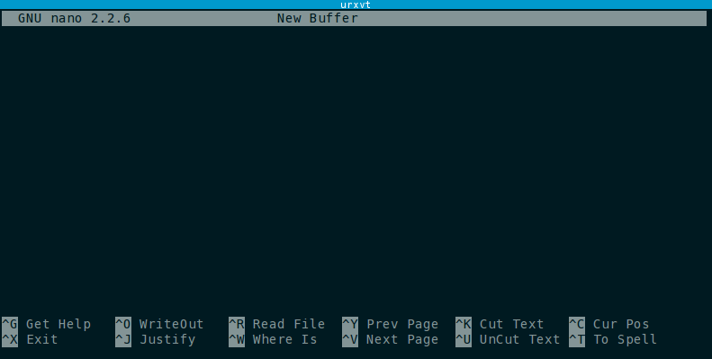
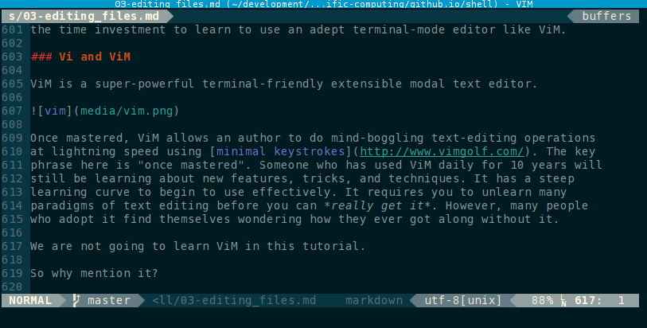

# Editing and Manipulating Text Files

Editing and manipulating text files from a terminal is a typical task. You may
find that with practice, using the terminal to edit text files is far easier and
more powerful than using a GUI text editor.

What we often call a "terminal" is in fact a *terminal emulator*. The first
terminals, before the advent of video displays, were actually *teletypewriters*
(abreviated *tty*). Text editing is quite literally what they were designed for.
[Click here](https://www.youtube.com/watch?feature=player_detailpage&v=X9ctLFYSDfQ#t=410)
to see how far we've come since the 60's.
{:.alert .alert-info}

## Find What You're Looking For

There are several useful commands that exist for finding a desired file.

### The Command `find`

The command `find` searches the filesystem for files based on their metadata.
The metadata that can be used to search for files includes, but is not limited
to a file's:

  * Filename
  * Filetype
  * Size
  * Creation Date
  * Access Date
  * Modification Date
  * Executables
  * Permission Mode

Unlike search mechanisms found outside a terminal (like Window Search or Apple's
Spotlight) which only list the files found, `find` can do things to the files it
finds. The tasks you can have `find` do are limited only by your imagination.
The syntax for `find` is:

``` nohighlight
find [-H] [-L] [-P] [-D debugopts] [-Olevel] [path...] [expression]
```

but the key to using find is in the path and expression arguments, which can be
complex.

The optional `path` arguments tell `find` where to begin looking for files. If
not given, the current directory is used.`find` will ordinarily enter
subdirectories, but not parent directories of the given paths. 

A good practice is to explicitly enter the path `.` to search the current
directory, even though it is the default path.
{:.alert .alert-info}

The `expression` is made up of *option switches*, *tests*, and *actions*, each
separated by an *operator*. The format of these expression elements varies, and
are fully documented in the manual page `man find`. There are *too many*
expression elements to cover here, but below are listed the ones that we think are
the most useful or noteworthy.

* * *

#### Options
 
Options affect the behavior of `find` as a whole. Commonly used options include:

`-depth`
  : Process a directory's contents before the directory itself. Basically work
  from the bottom up.

  Deleting directories requires they be empty, so some actions like `-delete`
  will imply `-depth` automatically.
  {:.alert .alert-warning}

`-maxdepth LEVEL`
  : Descend only to at most a positive integer LEVEL below the given path.

  Do not confuse `-maxdepth` with `-depth`: they have completely different
  behaviours and uses.
  {:.alert .alert-warning}

`-mindepth LEVEL`
  : Do not apply tests or actions at levels above LEVEL.

`-help`
  : Print usage hints to the terminal.

* * *

#### Tests
 
Tests are used to compare a file against some reference. If the test comparison
yields true, the next test or action in the expression (read left to right) is
applied. If a test yields false, `find` moves on to the next file. Commonly used
tests include:

`-name PATTERN`
`-iname PATTERN`
  : Match parts of the filename (excluding parent directories). `-name` is
  case-sensitive, whereas `-iname` is case-insensitive. The `PATTERN` can
  include **wildcard characters**.
  
  Common wildcards include:\\
  `*` which matches any number of any characters,\\
  `?` which matches one position of any character, and\\
  `[ EXPR ]` will match a **POSIX bracket expression** in one position. 
  The syntax for bracket expressions is beyond the scope of this tutorial but
  we'll see some examples of what they look like.
  {:.alert .alert-info}

`-regex REGEXP`
  : Matches the whole path against a **regular expression** also referred to as
  a **regex** or **regexp**.

  Regular expressions are an extremely powerful means of matching patterns. They
  are used in many places and are worth learning, but deserve a treatment in
  their own right.
  {:.alert .alert-info}

`-size n[bcwkMG]`
  : Matches files greater than n units of space. The suffixes correspond to
  blocks, bytes, words, kilobytes, Megabytes, and Gigabytes respectively.
^

`-readable`
`-writeable`
`-executable`
  : Matches files to which you have these access permissions.
^

`-type c`
  : Matches files of type `c` where `c` is typically one of\\
  `d` for directory,\\
  `f` for regular file, or\\
  `l` for symbolic link. Other types also exits.\\
  See the manual page for more info.
^

`-mtime [+-]N`
`-ctime [+-]N`
`-atime [+-]N`
  : Matches against modification, creation, or access timestamps exactly N days
  ago. If N is preceded by `+` (`-`), times greater (less) than N days ago are
  matched.
^

* * *

#### Actions

Actions do something, either emit a response from `find` or run an arbitrary
command on a matched file. By default, `find` does the action `-print` when it
matches a file, which prints the full file name (with path starting from a
path argument) separated by a new line. Commonly used actions include:

`-exec COMMAND... [{}];`
`-execdir COMMAND [{}];`
  : This option executes an arbitrary `COMMAND`. The command can be anything.
  All arguments following `-exec` are assumed to be part of the command until
  the first occurance of `;`. The characters `{}`, if encountered in the command
  expression, are replaced with the path to the currently examined file. If you
  used `-execdir`, find will run the command from the subdirectory containing the
  matched file.

`-ok COMMAND ;`
  : Like `-exec` but prompts the user before executing the command. Very useful
  if your expression may alter the file. It cannot take `{}` to represent the
  current matched file, so use it in conjunction with `-exec` as needed for
  safety.

`-print`
  : Prints the matched file's name.

`-printf FORMAT`
  : Prints the matched file's attributes according to FORMAT. See the man page
  for details.

`-quit`
  : Stop finding more files.

`-prune`
  : If the file is a directory, do not enter it. Used to eliminate
  subdirectories that you do not care to search.
{:.dl-horizontal}

* * *

#### Operators

Operators group expression elements together and allow for logic matching. The
operators, in decending order of precedence, are:

`( EXPR )`
  : Groups an expression together.
^

`! EXPR`
`-not EXPR`
  : Negates the expression.
^

`EXPR1 EXPR2`
`EXPR1 -a EXPR2`
`EXPR1 -and EXPR2`
  : Combines the two expressions with the logical conjunction "and".
  
By default, if two expressions are given without an operator joining them, the
operator `-and` is assumed.
{:.alert .alert-info}

`EXPR1 -o EXPR2`
`EXPR1 -or EXPR2`
  : Combines the two adjacent expressions with the logical disjunction "or".
^

`EXPR1 , EXPR2`
  : Processes both expressions, but discards the value of EXPR1 and uses the
  value of EXPR2. This is used in creative cases to search for multiple types of
  files in one traversal of the filesystem.
^

**Be mindful of the <kbd>Spaces</kbd> surrounding everything!** Each of the
expression elements is technically an argument. As said earlier, all arguments
must be separated by a space. This includes `(` and `)`
{:.alert .alert-warning}

Many shells treat the characters `*[]{}()?$` amongst others as special
operators. To prevent your shell from altering any input to `find`, **wrap
expressions in quotations** as necessary.
{:.alert .alert-warning}

* * *

#### Examples

Print all regular files named exactly ".bashrc" within and below `~`:

``` nohighlight
$ find ~ -type f -name bash.rc 
```

Print all regular files ending in "rc" within `~` and below:

``` nohighlight
$ find ~ -type f -name "*rc"
```

Print all files (regular and directories) ending in "rc" within `~`:

``` nohighlight
$ find ~ -name "*rc"
```

Print only directories one level into `/etc` that are 3 characters
long which end with "sh" or "sl"

``` nohighlight
$ find /etc -maxdepth 1 -type d -name "?s[hl]"
```

Find all files in `~` ending with ".jpg" or ".png" in any case that were created
within the last 2 days.

``` nohighlight
$ find ~ -type f \( -iname "*.jpg" -or -iname "*.png" \) -and -ctime -2
```

Find all the files strictly in `/tmp` named "data_NN.dat" where NN runs from
00-99 and run the command `ls -l FILE` on each of them: 

``` nohighlight
$ find /tmp -maxdepth 1 -type f -iname "data_[0-9][0-9].dat" -execdir ls -l {} \;
```

Have you ever needed to analyze hundreds of data files?  Imagine if instead of
calling `ls` on these files, you called a program that you wrote to analyze that
data. This is a quick way to generate those hundreds of plots you need to
process from your research data.
{:.alert .alert-info}

### The Command `grep`

Sometimes what you're looking for is *inside* a file. We can use the command
`grep`  to find lines in a file or set of files that match a given pattern. This
is no ordinary document search. `grep` allows the use of regular expressions to
match against complicated patterns (the name is short for **g**lobally search a
**r**egular **e**xpression and **p**rint). The basic syntax is

``` nohighlight
grep [OPTIONS] PATTERN [FILE...]
```

`grep` searchs all given FILEs for the given PATTERN. The pattern type and
output can be customized through various options. If no file is given, grep will
search standard input.

`grep` expects a regex. As said before, the details of writing a regular
expression are beyond the scope of this tutorial, but we'll show you some
examples of how to use `grep` and the power of regular expressions anyway:

Find all lines containing the word 'alias' in ~/.bashrc:

``` nohighlight
$ grep alias ~/.bashrc
```

Find all the lines containing 'apple' in the unix dictionary file:

``` nohighlight
$ grep apple /usr/share/dict/words
```

Use a regex to find all lines containing 'apple' when 'apple' doesn't start or end
a word:

``` nohighlight
$ grep -E "[a-z]+apple[a-z]+" /usr/share/dict/words
```

Find all the words starting with 'zo' and ending in 'ing' as long as they do not
end in 'zing' or 'sing':

``` nohighlight
$ grep -E "^zo.*[^zs]ing$" /usr/share/dict/words 
```

Find all the words starting with 'zo' and ending in either 'zing' or 'sing':

``` nohighlight
$ grep -E "^zo.*[zs]ing$" /usr/share/dict/words 
```

Find all lines that start with 'class' preceeded by any amount of whitespace in
each file in the Python library directory.

``` nohighlight
$ grep -A 4 -d skip -E "^\s*class" /usr/lib/python2.7/site-packages/*
```

Find the declarations of all the Python functions in all the Python files in the
Python library directory that take exactly three arguments that are not cast into
tuples and show their line numbers.

``` nohighlight
$ grep -n -d skip -E "^\s*def\s[a-zA-Z]*\(([^\(\),]*,){2}[^\(\),]*\)" /usr/lib/python2.7/site-packages/*
```

Good luck trying to search for something that specific in Windows. Just imagine
if your text editor could do find and replace operations using regular
expressions...
{:.alert .alert-info}

There are a number of options that can be used with `grep` to find exactly what
you are looking for. A few of the most useful ones include:

`-m NUM`
`--max-count=NUM`
  : Stop reading a file after NUM matches.

`-n`
`--line-number`
  : Prefix the line number where the match occurs in the output.

`-A NUM`
`--after-context=NUM`
  : Print NUM lines following a match. Useful if you are looking for an unknown
  expression near a known expression.

`-B NUM`
`--before-context=NUM`
  : Print NUM lines preceeding a match.

`-C NUM`
`--context=NUM`
  : Print NUM lines preceeding and following a match.

`-d ACTION`
`--directories=ACTION`
  : Controls how `grep` behaves when it encounters a directory. Default is
  'read', but can be 'skip' or 'recurse' as well.

## Reading Files

### The Commands `head`, `tail` and `cat`

The command `head` prints the first 10 lines of each file passed to it to
standard output. The option `-n NUM` can be used to show NUM lines instead of 10.

```nohighlight
$ head /etc/passwd
```

The command `tail` prints the last 10 lines of a file to standard output. Like
`head`, you can pass the option `-n NUM` to change the number of lines printed.

```nohighlight
$ tail /etc/passwd
```

The `-f` switch will continue to print output as the file grows. This is useful
for watching log files to test and debug programs.

The command `cat` (short for concatenate) will concatenate all files passed to
it and print them to standard output. This is useful for reading small files by
themselves. The real use of `cat` is to combine files, especially when used with
**stream redirection** and **pipes**, both of which we'll talk about later.

```nohighlight
$ cat /etc/passwd /etc/group
```

### Pagers and `less`

The best way to actually read a text file in the terminal is to use a **pager**.
A pager allows one to view and move through a text file 'one page at a time'.
One of the earliest pagers was a program called `more` that allowed a user to
step forward (and only forward) through a long stream of text lines. This
limitation makes using `more` to read through a text stream cumbersome. Thus
`more` has been largely supplanted by a program called `less` for paging in
terminals. `less` is the default pager on most systems.

The authors of GNU software often have terrible senses of humor. In this case
naming the program `less` because `less` is 'more' while `more` is 'less'.
{:.alert .alert-info}

If you've looked at a man page, the output was probably dumped into `less`,
which takes up the whole terminal screen.

We can load a document into `less` by calling:

```nohighlight
$ less FILE
```

You can scroll text in `less` using the <kbd>Up</kbd> and <kbd>Down</kbd> keys.
However, you can also scroll up and down using <kbd>k</kbd> and <kbd>j</kbd>
respectively.

You'll notice that <kbd>k</kbd> and <kbd>j</kbd> are the keys the most powerful
fingers of your right hand rest on when your hands are in the touch-typing home
row. This is a common theme in many programs and stems from a program which
we'll talk about in a moment called `vi`.
{:.alert .alert-info}

There are many keyboard short-cuts in `less`. Some of the most useful are:

<kbd>q</kbd>
  : Quits `less` and returns you to the terminal prompt.

<kbd>g</kbd>
  : Takes you to the top of the document, or, if a number N is typed before pressing
  <kbd>g</kbd>, takes you to the Nth line of the document.

<kbd>G</kbd>
  : Takes you to the end of the document.

<kbd>Space</kbd>
  : Scrolls down one page at a time.

<kbd>m</kbd>
  : When <kbd>m</kbd> is pressed and followed by any lowercase letter, the
  current position in the document is bookmarked to that letter name.

<kbd>'</kbd>
  : A single quote followed by a lowercase letter returns the view bookmarked
  with that letter.

<kbd>/EXPR</kbd>
<kbd>?EXPR</kbd>
  : Searchs forward or backward through the document for text matching the
  regular expression EXPR. If a match is found, the pager jumps to the matching
  text.

<kbd>n</kbd>
<kbd>N</kbd>
  : Repeats the previous search, jumping to the next search match. <kbd>N</kbd>
  repeats the search in reverse direction.  
{:.dl-horizontal}

## Editing Files

Editing text is done properly using a dedicated text editor. There are many
available for use in a terminal, and we'll look at the basics of the most
commonly available.

### Nano

The default terminal text editor on Ubuntu-based flavors of GNU/Linux is a
program called `nano` (a recursive acronym for "**n**ano is **ano**ther editor).

Nano is easy to learn and simple to use. Nano is good for those who are new to
terminal text editors because of both its simplicity as well as its on-screen help
mode which is enabled by default and gives hints about how to use it.

Nano is invoked by calling:

``` nohighlight
$ nano [OPTIONS] [[+LINE,COLUMN] FILE]...
```



At the bottom of the program are the help mode hints. The symbol `^` indicates
the <kbd>Ctrl</kbd> key. So pressing <kbd><kbd>Ctrl</kbd> <kbd>g</kbd></kbd>
will bring up an on-screen help menu. Keyboard shortcuts with `M-` indicate the
'meta' key which is typically <kbd>Alt</kbd>.

<kbd>Ctrl G</kbd>
  : Display the help text

<kbd>Ctrl X</kbd>
  : Close the current file buffer / Exit from nano

<kbd>Ctrl O</kbd>
  : Write the current file to disk

<kbd>Ctrl J</kbd>
  : Justify the current paragraph

<kbd>Ctrl W</kbd>
  : Search for a string or a regular expression

<kbd>Ctrl Y</kbd>
  : Go to previous screen

<kbd>Ctrl V</kbd>
  : Go to next screen

<kbd>Ctrl K</kbd>
  : Cut the current line and store it in the cutbuffer

<kbd>Ctrl U</kbd>
  : Uncut from the cutbuffer into the current line

<kbd>Ctrl C</kbd>
  : Display the position of the cursor

<kbd>Ctrl T</kbd>
  : Invoke the spell checker, if available

<kbd>Alt \</kbd>
  : Go to the first line of the file

<kbd>Alt /</kbd>
  : Go to the last line of the file

<kbd>Ctrl \_</kbd>
  : Go to line and column number

<kbd>Ctrl \\</kbd>
  : Replace a string or a regular expression

<kbd>Ctrl ^</kbd>
  : Mark text at the cursor position

<kbd>Alt W</kbd>
  : Repeat last search

<kbd>Alt ^</kbd>
  : Copy the current line and store it in the cutbuffer

<kbd>Alt }</kbd>
  : Indent the current line

<kbd>Alt {</kbd>
  : Unindent the current line

<kbd>Ctrl Space</kbd>
  : Go forward one word

<kbd>Alt Space</kbd>
  : Go back one word
{:.dl-horizontal}

Lines that are longer than the width of the terminal are, by default, allowed to
go off the screen. When this happens, a `$` symbol is shown at the edge of the
line where it continues off-screen.

Nano has a soft-wrap mode that will wrap lines on screen, but not put hard
carraige returns in the lines. It also has a hard-wrap mode where long lines
will be broken up into new lines. Be careful about which wrapping mode you are
in, especially when editing programs, scripts, and configuration files.
{:.alert .alert-warning}

Nano is a safe choice for quickly editing a file in a terminal, but its
simplicity and heavy use of <kbd>Ctrl</kbd> in editing operations makes it hard
to use for any serious writing, especially programming. A better alternative is
to use a more fully featured editor with a more comfortable interface. If you
are working with files on a local machine, then a GUI-based text editor like
Sublime Text, Gedit, Textmate, Kate, Notepad++ may be a better choice.

If you must do lots of serious editing in a terminal (for example, you do a lot
of work on a remote cluster on the other side of the world where your experiment
resides over a crummy trans-pacific network connection), then it may be worth
the time investment to learn to use an adept terminal-mode editor like ViM.

### Vi and ViM

ViM is a super-powerful terminal-friendly extensible modal text editor.



Once mastered, ViM allows an author to do mind-boggling text-editing operations
at lightning speed using [minimal keystrokes](http://www.vimgolf.com/). The key
phrase here is "once mastered". Someone who has used ViM daily for 10 years will
still be learning about new features, tricks, and techniques. It has a steep
learning curve to begin to use effectively. It requires you to unlearn many
paradigms of text editing before you can *really get it*. However, many people
who adopt it find themselves wondering how they ever got along without it.

We are not going to learn ViM in this tutorial.

So why mention it?

Long, long ago in the before-time, there was `ed`, the **ed**itor. But `ed` was
awful and was replaced by `ex`, the **ex**tended editor. And then CRT monitors
replaced teletypewriters, and `ex` was given a **vi**sual mode which came to be
called `vi`. `vi` lives on today as the *de facto* standard Unix editor and is
available on virtually all Unix-like systems. However, `vi` is an extremely
minimal editor. Yet the nature of how it works is very appealing so it was
improved into a full-featured editor `vim` or the "**vi** i**m**proved" editor.
`vim` adds a great many features beyond what `vi` was originally designed
for.

As you spend more and more time working in a terminal, and because of the long
historical relationship between `vi` and Unix, there is a good chance that you
may one day find yourself suddenly in a `vi` session. When that happens, if you
have not been exposed to `vi`, nothing will quell your panic.

> 
> You press the keys with no effect,\\
> Your mode is not correct.\\
> The screen blurs, your fingers shake;\\
> You forgot to press escape.\\
> Can't insert, can't delete,\\
> Cursor keys won't repeat.\\
> You try to quit, but can't leave,\\
> An extra "bang" is all you need.\\
> \\
>   -- Chuck Musciano, *Addicted To vi*
>

`vi` and it's younger cousin `vim` are *modal editors*. These editors can be put
into a number of **modes** within which keypresses do specific actions. The two
most important modes are **normal mode** and **insert mode**. Upon startup `vi`
and `vim` will be in normal mode. Here, the keys <kbd>h</kbd>, <kbd>j</kbd>,
<kbd>k</kbd>, and <kbd>l</kbd> can be used to move the cursor left, down, up,
and right respectively. Essentially every key *does something* in normal mode.
Key combinations do even more things. 

One must be careful about hitting random keys in `vi`/`vim`'s normal mode. For
instance the key sequence <kbd>ggdG</kbd> will appear to erase the whole
document. It does the same thing as <kbd><kbd>Ctrl-a</kbd>
<kbd>Ctrl-v</kbd></kbd> would in GUI text editor.
{:.alert .alert-warning}

Pressing <kbd>u</kbd> in normal mode will undo the last change. `vim` keeps a
lengthy default undo history.
{:.alert .alert-info}

`vi` keeps only one operation in its undo history. Don't mess up!
{:.alert .alert-danger}

To actually enter text, you need to switch modes to insert mode. This can be
done many ways. From normal mode, you can start editing text in insert mody by pressing:

<kbd>i</kbd>
  : To insert text where the cursor cursor currently is. This is the ordinary way to enter insert mode.
  
<kbd>a</kbd> 
  : Enter insert mode to append text immediately after the cursor.

<kbd>I</kbd>
  : Enter insert mode to insert text at the beginning of the current line

<kbd>A</kbd>
  : Enter insert mode to append text at the end of the line

<kbd>o</kbd>
  : To open a new line below the cursor and insert text there.

...
  : So on and so forth
{:.dl-horizontal}
  
There are thousands of keybindings that do specific things. When you learn
to use them, you can edit text faster and easier than you ever have before but
you can see how these editors are not for the faint of heart.

Pressing <kbd>Esc</kbd> will return you from insert mode back to normal mode. In
normal mode, you can also issue commands to the editor from a command line mode.
To enter command mode, press <kbd>:</kbd>. Once in command mode, a `:` appears
at the bottom of the editor. Typing will write out the command after the `:` and
pressing <kbd>Enter</kbd> will issue the command.

The commands you need to know are:

`:q`
  : Quits the editor. If there are unsaved changes and
you wish to quit without saving, you must issue the command `:q!`.

`:w`
 : Saves (writes) any changes to the file. If creating a new document with no
 file yet, you must issue the command `:w FILENAME`.
{:.dl-horizontal}
 
Commands can be chained together. For instance, the command `:wq` will save the
file and then quit the editor.
{:.alert .alert-info}

This is the bare minimum you need to know if you ever find yourself
spontaneously in a `vi` session editing some crucial file.
{:.alert .alert-info}

For the record, this entire tutorial page was written in ViM, which is _by far_
the author's favorite editor for everything between plain text and programming.
It takes a few weeks of learning to become modestly proficient and a few years
to master, but if you spend much of your day writing documents or code, the
effort put into learning ViM is absolutely worth it. Oh, and it does
find-and-replace operations using regular expressions.

{::comment}
### Emacs

I do not know enough about emacs to write anything about it.
{:/comment}

